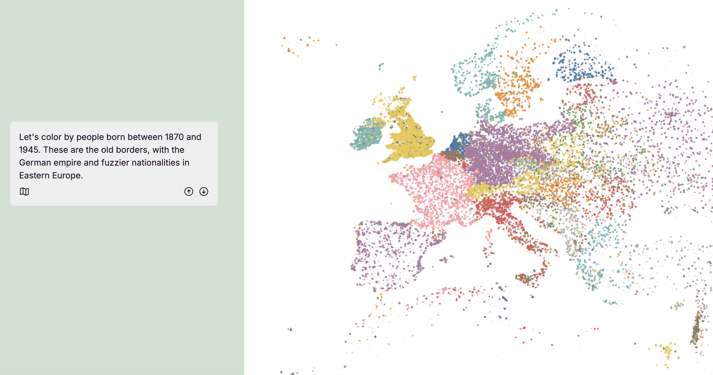

This is an example repository for creating [Data Stories](https://docs.nomic.ai/atlas/data-maps/data-stories) with [Nomic Atlas](https://atlas.nomic.ai)

Data Stories are web pages with scrollable views of Atlas data maps.

You can simply run:

```bash
npm run dev
```

to open the application and read one of the available stories.

<div style="display: flex; flex-direction: column; gap: 20px; margin: 30px 0;">
  <div>
    
  </div>
  <div style="display: flex; gap: 20px;">
    
    
  </div>
</div>

# Make Your Own Data Story

For a more in depth guide, visit our [docs](https://docs.nomic.ai/atlas/data-maps/guides/create-your-own-atlas-data-story)

1) Explore your data in Atlas & generate a share link for each different view of the data you want in your story.

Share links are generated by clicking "Share" in the top-right corner of the Atlas interface & copying your link.

https://github.com/user-attachments/assets/25c39445-f9b1-4607-964b-ef1966443956

2) This creates a link of the format `https://atlas.nomic.ai/data/ORG_NAME/MAP_NAME/map/MAP_ID#XXXX` with a four-item #XXXX code at the end of the share link.

You will add these codes to Folios, which show the user the same view of the Atlas data map in your website/blog that you saw in the Atlas interface.

Import Scrollyteller and Folio at the top of your file, and include your `Folio` components with the `hash` parameter set to each code for each view of the data inside of the `Scrollyteller` component, e.g.:

```markdown
import React from 'react';
import { Scrollyteller, Folio } from '@nomic-ai/atlas-stories-react';
import '@nomic-ai/atlas-stories-react/dist/style.css';
...
...

<Scrollyteller map='ORG_NAME/MAP_NAME/map/MAP_ID'>


<Folio
hash="vYoe"
>

Education is...

</Folio>

<Folio
hash="oZyE"
>

Tax policy...

</Folio>

...
...

</Scrollyteller>

```

3) On page load you will then see each Atlas map state to the side of your Folio text:


https://github.com/user-attachments/assets/25578584-6e16-4589-a461-3561a7826dca

# Parameters

- hash: the code for the data map state from the Atlas share link, e.g. `hash="oZyE"`

- duration: the time in milliseconds for the transition from the previous folio to the current one, e.g. `duration={2000}` for 2 seconds.

- zoom: the coordinates of the view box, e.g. `zoom={{ x: [-55 , 55], y: [-55, 55] }}`

# Join our Slack

We invite you to join our [Nomic Community Slack](https://join.slack.com/t/nomic-community/shared_invite/zt-3173tk278-kPJgDFGyPukUKwTYz8RRZQ) so you can ask questions and brainstorm data mapping ideas with the Nomic team & our community of users.